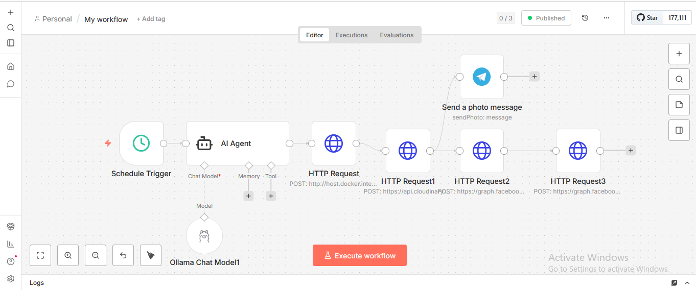
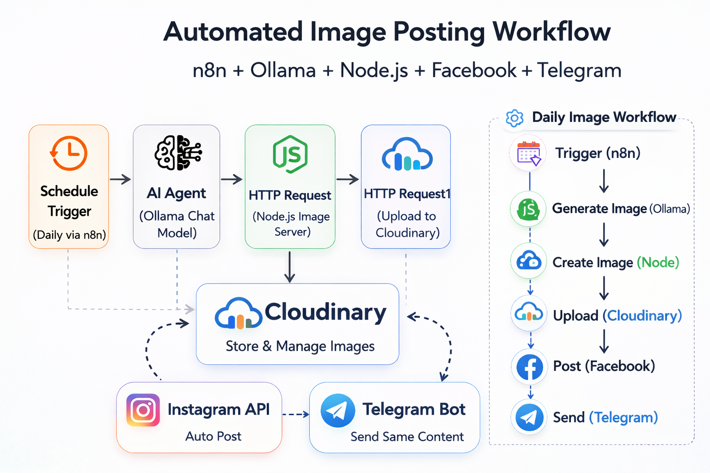
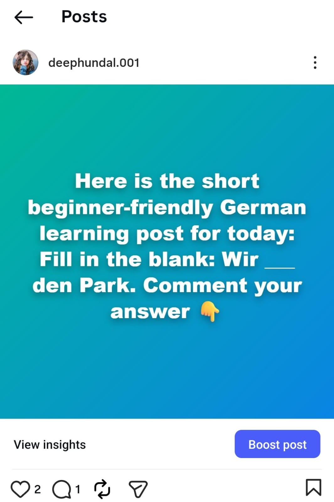
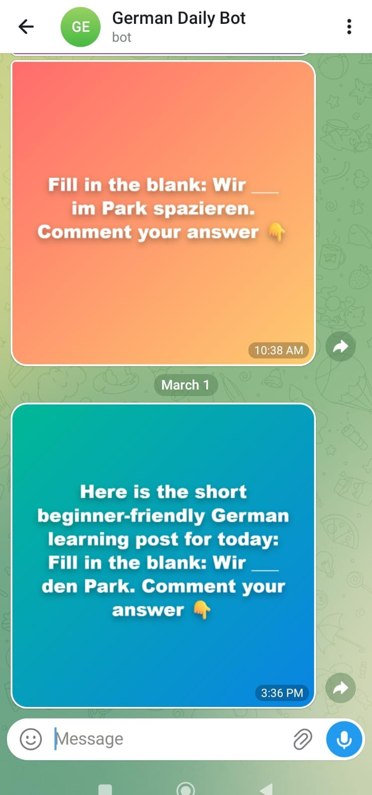

# 🤖 AI Content Automation System

## 📌 Overview
Automated AI pipeline that:

- Generates content using Ollama
- Creates images using Node.js (Express server)
- Uploads images to Cloudinary
- Posts automatically to Instagram
- Sends same content to Telegram
- Runs daily using n8n Schedule Trigger

## 🏗 Architecture
n8n → Ollama → Node Image Server → Cloudinary → Instagram API → Telegram API

## 🚀 Run Locally

cd image-generator
npm install
node server.js

Server runs on: http://localhost:4000

## 📸 Project Screenshots

### 🧠 AI Agent Workflow

### 📊 Flow Diagram

### 📸 Instagram Post

### ✈ Telegram Post

